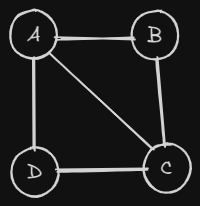
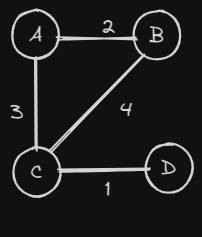

# Representation Of Graph

A graph can be represented in different ways. Here are two ways that we can use to represent a graph

## 1. Adjacency Matrix

  The graph is reseprented in the form of 2D array of size V x V where V is number of vertex and `Matrix[i][j]` contains 0 or 1, if it's 0 then there is no `edge` between i and j `vertex` else there is a vertex.




|   | A  | B  | C  | D  |
|---|---|---|---|---|
| **A** | 0 | 1 | 1 | 1 |
| **B** | 1 | 0 | 1 | 0 |
| **C** | 1 | 1 | 0 | 1 |
| **D** | 1 | 0 | 1 | 0 |

## 2. Adjacency List

The Graph is represented in the form of `map` from nodes to list of edges. `Map` can be an array for simplicity where `i` represent key and `Graph[i]` is a list of edges connected with `i`.

(we can emit source in this Edge representation)



```
A -> [(A, B, 2), (A, C, 3)]
B -> [(B, A, 2), (B, C, 4)]
C -> [(C, A, 3), (C, B, 4), (C, D, 1)]
D -> [(D, C, 1)]
```

```java
// this represents an edge from source to neighbour
public class Edge {
  public int source;
  public int neighbour;
  public int weight;

  public Edge(int source, int neighbour, int weight) {
    this.source = source;
    this.neighbour = neighbour;
    this.weight = weight;
  }
}
//this will be actual graph
List<List<Edge>> graph;
``````